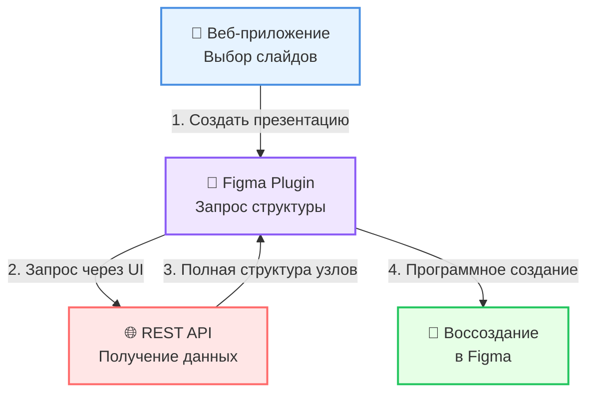

# 🚀 Автоматическое копирование слайдов в SlideDeck 2.0

## 🎯 Обзор

SlideDeck 2.0 теперь поддерживает **полностью автоматическое копирование слайдов** из любых файлов Figma! Никаких ручных операций - плагин сам воссоздаёт все элементы с сохранением полной редактируемости.

### ✨ Ключевые преимущества:
- ✅ **100% автоматизация** - никакого ручного копирования
- ✅ **Кросс-файловая работа** - слайды из любых файлов Figma
- ✅ **Полная редактируемость** - все элементы остаются векторными
- ✅ **Сохранение всех свойств** - стили, эффекты, Auto Layout
- ✅ **Поддержка изображений** - автоматическая загрузка всех картинок

## 🔧 Как это работает?

### Технический процесс:

1. **Веб-приложение** собирает информацию о выбранных слайдах
2. **Плагин** запрашивает полную структуру узлов через REST API
3. **REST API** извлекает из Figma файлов:
   - Структуру всех элементов
   - Стили и эффекты
   - Тексты и шрифты
   - URL изображений
4. **Плагин** программно воссоздаёт каждый элемент

## 📋 Пошаговая инструкция

### 1. Создайте презентацию в веб-приложении

- Откройте SlideDeck 2.0
- Нажмите "Создать презентацию"
- Выберите слайды из библиотеки
- Выберите метод "Figma плагин"
- Нажмите "Создать в Figma"

### 2. Запустите плагин в Figma

- Откройте Figma
- Запустите плагин "SlideDeck 2.0 - Presentation Creator"
- Нажмите "Получить данные презентации"

### 3. Наблюдайте за магией! ✨

Плагин автоматически:
- Получит структуру всех слайдов
- Создаст новую страницу
- Воссоздаст каждый слайд со всеми элементами
- Организует слайды в презентацию

## 🎨 Что копируется автоматически?

### ✅ Полностью поддерживается:
- **Фреймы и группы** - вся иерархия элементов
- **Фигуры** - прямоугольники, эллипсы, векторы
- **Тексты** - со всеми стилями и форматированием
- **Изображения** - автоматическая загрузка и вставка
- **Стили** - цвета, градиенты, обводки
- **Эффекты** - тени, размытие, etc.
- **Auto Layout** - все настройки сохраняются
- **Скругления** - включая независимые радиусы

### ⚠️ Ограничения:
- Компоненты создаются как обычные фреймы
- Внешние библиотеки стилей не подключаются
- Некоторые плагины могут использовать свойства, которые не копируются

## 💡 Советы для лучших результатов

### Оптимизация слайдов:
- Используйте фреймы размером 1920x1080 для единообразия
- Группируйте связанные элементы
- Используйте понятные имена слоев

### Работа с изображениями:
- Все изображения загружаются автоматически
- Большие изображения могут загружаться дольше
- Убедитесь в стабильном интернет-соединении

### Производительность:
- Сложные слайды могут обрабатываться несколько секунд
- Рекомендуется не более 50 слайдов за раз
- При большом количестве - создавайте несколько презентаций

## 🐛 Решение проблем

### Слайд не скопировался полностью
**Причина**: Неподдерживаемый тип элемента
**Решение**: Проверьте консоль плагина для деталей

### Изображения не загрузились
**Причина**: Проблемы с сетью или правами доступа
**Решение**: Убедитесь, что файлы Figma доступны для чтения

### Текст отображается неправильно
**Причина**: Отсутствует шрифт
**Решение**: Плагин автоматически заменит на Inter

## 🔐 Безопасность

- Все запросы идут через ваш Figma токен
- Данные не сохраняются на сторонних серверах
- Изображения загружаются напрямую из Figma

## 🚀 Будущие улучшения

- Поддержка компонентов и вариантов
- Сохранение связей с библиотеками
- Batch-обработка больших презентаций
- Прогресс-бар для каждого элемента

## 🎉 Заключение

Автоматическое копирование в SlideDeck 2.0 - это революционное решение, которое экономит часы работы и гарантирует идеальное воспроизведение слайдов из любых файлов Figma! 