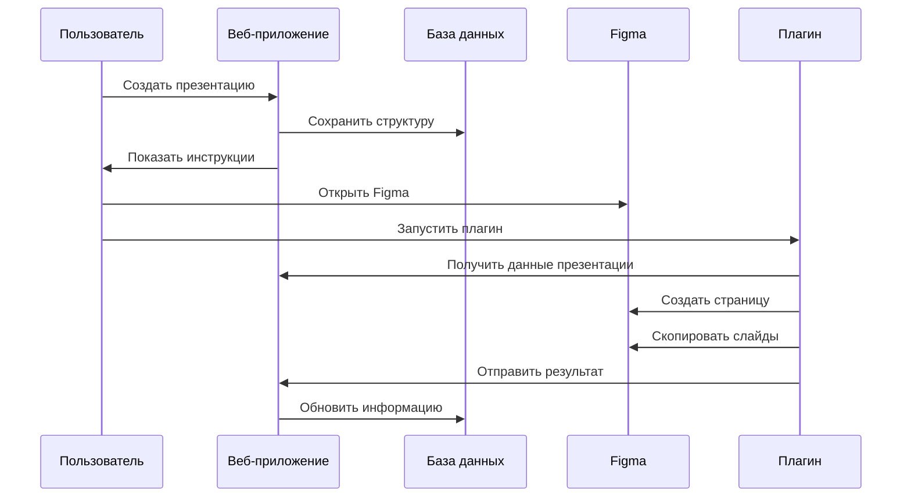

# 🔌 Интеграция Figma плагина в SlideDeck 2.0

## 📋 Обзор

SlideDeck 2.0 теперь поддерживает два метода создания презентаций:

1. **Виртуальные презентации** - Быстрое создание с сохранением структуры в базе данных
2. **Figma плагин** - Реальное создание файлов в Figma с копированием слайдов

## 🚀 Установка плагина

### 1. Сборка плагина

```bash
cd figma-plugin
npm install
npm run build
```

### 2. Установка в Figma

1. Откройте Figma Desktop или веб-версию
2. Идите в `Plugins` → `Development` → `Import plugin from manifest...`
3. Выберите файл `figma-plugin/dist/manifest.json`
4. Плагин появится в разделе "Development"

## 🎯 Использование

### Создание презентации через веб-интерфейс

1. **Откройте конструктор презентаций**
   - Нажмите "Создать презентацию" в главном интерфейсе
   - Перетащите нужные слайды в презентацию

2. **Выберите метод создания**
   - Установите переключатель "Figma плагин"
   - Введите название и описание презентации

3. **Запустите создание**
   - Нажмите "Создать в Figma"
   - Система передаст данные в плагин Figma

4. **Активируйте плагин в Figma**
   - Откройте Figma
   - Запустите плагин "SlideDeck 2.0 - Presentation Creator"
   - Нажмите "Создать презентацию в Figma"

### Прямое использование плагина

1. Откройте файл Figma для создания презентации
2. Запустите плагин из меню
3. Введите данные презентации вручную или получите от веб-приложения
4. Создайте презентацию

## ⚙️ Архитектура интеграции

### Компоненты системы

```
Web App (Next.js)
├── PresentationBuilder.tsx    # UI с выбором метода создания
├── /api/presentations/create  # API создания презентации
├── /api/presentations/plugin  # API интеграции с плагином
└── Database (Prisma)          # Хранение структуры презентаций

Figma Plugin
├── code.ts        # Основная логика плагина
├── ui.html        # Интерфейс плагина
├── manifest.json  # Конфигурация плагина
└── types.d.ts     # TypeScript типы
```

### Поток данных



## 🔧 Технические детали

### API Endpoints

#### POST `/api/presentations/create`
```typescript
// Запрос
{
  title: string;
  description?: string;
  slides: Array<{
    slideId: string;
    order: number;
  }>;
  usePlugin?: boolean;  // Новый флаг
}

// Ответ для плагина
{
  success: true;
  method: 'plugin';
  presentationId: string;
  figmaUrl: string;
  pluginData: {
    title: string;
    description?: string;
    slides: SlideData[];
    webAppUrl: string;
  }
}
```

#### GET `/api/presentations/plugin?presentationId=ID`
```typescript
// Ответ
{
  success: true;
  data: {
    title: string;
    description?: string;
    slides: SlideData[];
    webAppUrl: string;
  }
}
```

#### POST `/api/presentations/plugin`
```typescript
// Результат от плагина
{
  presentationId: string;
  success: boolean;
  figmaFileId?: string;
  figmaUrl?: string;
  copiedSlides?: number;
  errors?: number;
}
```

### Типы данных

```typescript
interface SlideData {
  id: string;
  title: string;
  figmaFileId: string;
  figmaNodeId: string;
  imageUrl?: string;
  order: number;
}

interface PresentationRequest {
  title: string;
  description?: string;
  slides: SlideData[];
  webAppUrl: string;
}
```

## 🎨 Возможности плагина

### ✅ Реализованные функции

- **Создание новых страниц** в Figma для презентаций
- **Клонирование слайдов** из того же файла
- **Улучшенные плейсхолдеры** для слайдов из других файлов
- **Автоматическая организация** слайдов в сетке 3×N
- **Прогресс и статус** операций с уведомлениями
- **Интеграция с веб-приложением** через API

### 🔄 Планируемые улучшения

- **Импорт между файлами** (требует расширенного API)
- **Пользовательские шаблоны** раскладки слайдов
- **Batch-операции** для множественных презентаций
- **Экспорт в PDF** прямо из плагина

## ⚠️ Ограничения Figma API

### Текущие ограничения

1. **Межфайловое копирование** - Figma Plugin API не позволяет прямое копирование узлов между файлами
2. **Доступ к закрытым файлам** - Нужны открытые файлы или специальные права
3. **Сетевые запросы** - Ограничены доменами в манифесте

### Обходные решения

1. **Плейсхолдеры** - Создаём информативные заглушки для внешних слайдов
2. **Метаданные** - Сохраняем всю информацию об исходных слайдах
3. **Инструкции** - Показываем пользователю как импортировать вручную

## 🛠️ Разработка и отладка

### Настройка среды разработки

```bash
# Основное приложение
npm install
npm run dev

# Плагин
cd figma-plugin
npm install
npm run dev  # Автоматическая пересборка
```

### Отладка плагина

1. **Developer Tools в Figma**
   - `Ctrl+Option+I` (Mac) или `Ctrl+Shift+I` (Windows)
   - Консоль покажет логи плагина

2. **Логирование**
   ```typescript
   console.log('Отладочная информация:', data);
   figma.ui.postMessage({
     type: 'log',
     message: 'Сообщение для UI'
   });
   ```

3. **Тестирование API**
   ```bash
   # Тест создания презентации
   curl -X POST http://localhost:3000/api/presentations/create \
     -H "Content-Type: application/json" \
     -d '{"title":"Test","slides":[],"usePlugin":true}'
   ```

## 📊 Мониторинг и аналитика

### Логирование операций

Все операции плагина логируются:
- Создание презентаций
- Копирование слайдов
- Ошибки и исключения
- Производительность операций

### Метрики

- Время создания презентации
- Количество скопированных слайдов
- Частота использования плагина vs веб-интерфейса
- Процент успешных операций

## 🔐 Безопасность

### Разрешения плагина

```json
{
  "permissions": ["currentuser"],
  "networkAccess": {
    "allowedDomains": [
      "https://api.figma.com",
      "http://localhost:3000",
      "https://*.vercel.app"
    ]
  }
}
```

### Валидация данных

- Проверка типов данных от веб-приложения
- Валидация ID файлов и узлов
- Санитизация пользовательского ввода

## 📈 Планы развития

### v2.1.0 - Улучшенный импорт
- Поддержка Component instances
- Импорт стилей и библиотек
- Пакетная обработка презентаций

### v2.2.0 - Шаблоны и настройки
- Пользовательские шаблоны раскладки
- Настройки размеров и отступов
- Темы оформления плейсхолдеров

### v2.3.0 - Расширенная интеграция
- Автоматическое обновление слайдов
- Синхронизация изменений
- Коллективная работа

## 🆘 Поддержка

### Частые проблемы

**Q: Плагин не находит слайды**
A: Убедитесь, что исходные файлы открыты в Figma

**Q: Ошибка "Cannot create node"**
A: Проверьте права доступа к файлу и корректность node ID

**Q: Плагин не получает данные от веб-приложения**
A: Проверьте network permissions в манифесте плагина

### Контакты

- GitHub Issues: [ссылка на репозиторий]
- Документация: [ссылка на docs]
- Email: support@slidedeck.com

---

## ✨ Заключение

Интеграция Figma плагина значительно расширяет возможности SlideDeck 2.0, позволяя создавать реальные файлы презентаций в Figma с автоматическим копированием и организацией слайдов. 

Несмотря на текущие ограничения Figma API, система предоставляет мощный инструмент для быстрого создания профессиональных презентаций с сохранением всех возможностей редактирования в Figma. 